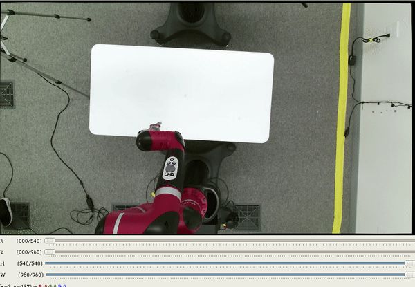
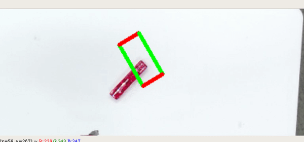
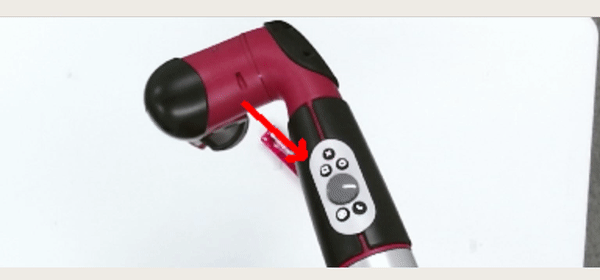

# Script for collecting grasping or pushing data
Steps to use the script
1. Launch the robot and camera

2. Publish the transform between robot and camera

3. Select the image workspace and accordingly update image_region.yaml 
```buildoutcfg
python choose_camera_workspace.py
```



4. Update `table.yaml` based on setup

5. Collect data
```buildoutcfg
# for grasping data collection
python agent.py --action grasp --z-min -0.15
```


```buildoutcfg
# for pushing 
python agent.py --action push --z-min -0.15
```

```
NOTE: z-min is the z cordinate of gripper pose when it touches table vertically
Take a look at agent.py for to know more about other arguments
```
