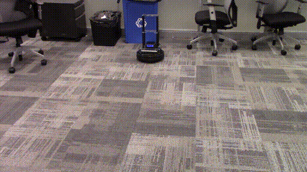
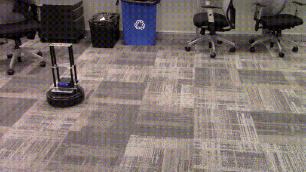

- Kobuki position control: `python examples/locobot/navigation/base_position_control.py --base_planner none --base_controller ilqr --smooth --close_loop --relative_position 1.,1.,1.57 --botname locobot`\
   
- Kobuki position control: `python examples/locobot/navigation/base_position_control.py --base_planner none --base_controller ilqr --smooth --close_loop --relative_position 1.5,1.5,0 --botname locobot`\
   
- Kobuki tracking twocircles in openloop: `python examples/locobot/navigation/base_trajectory_tracking.py --noclose_loop --type twocircles --botname locobot`
   
- Kobuki tracking twocircle in closeloop: `python examples/locobot/navigation/base_trajectory_tracking.py --close_loop --type twocircles --botname locobot` \
   
- Create tracking twocircles in openloop: `python examples/locobot/navigation/base_trajectory_tracking.py --noclose_loop --type twocircles --botname locobot`\
  
- Create tracking twocircle in closeloop: `python examples/locobot/navigation/base_trajectory_tracking.py --close_loop --type twocircles --botname locobot`\
  
